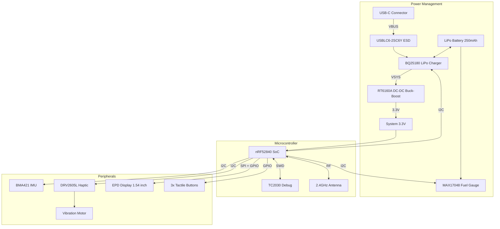

# InkTime - Smartwatch Open Source

## Diagrama Bloc

## Bill of Materials (BOM)

| Referință | Componentă | Valoare / Pachet | Datasheet | Link JLCParts / Procurare |
|:---|:---|:---|:---|:---|
| **U1** | Nordic nRF52840 | nRF52840-QIAA (QFN-73) | [Datasheet](https://infocenter.nordicsemi.com/pdf/nRF52840_PS_v1.7.pdf) | [C190794](https://jlcpcb.com/partdetail/NordicSemiconductor-nRF52840QIAA/C190794) |
| **IC1** | TI BQ25180 | LiPo Charger (DSBGA-8) | [Datasheet](https://www.ti.com/lit/ds/symlink/bq25180.pdf) | [C3682423](https://jlcpcb.com/partdetail/TexasInstruments-BQ25180YBGR/C3682423) |
| **IC9** | Richtek RT6160A | DC-DC Buck-Boost 3.3V | [Datasheet](https://www.richtek.com/assets/product_file/RT6160A/DS6160A-00.pdf) | [C7065276](https://jlcpcb.com/partdetail/RichtekTech-RT6160AWSC/C7065276) |
| **U3** | Analog MAX17048 | Fuel Gauge (TDFN-8) | [Datasheet](https://www.analog.com/media/en/technical-documentation/data-sheets/MAX17048-MAX17049.pdf) | [C2682616](https://jlcpcb.com/partdetail/2777647-MAX17048GT10/C2682616) |
| **IC3** | Bosch BMA421 | Accelerometru (LGA-12) | [Datasheet](https://www.bosch-sensortec.com/media/boschsensortec/downloads/datasheets/bst-bma423-ds000.pdf) | [C5242966](https://jlcpcb.com/partdetail/BoschSensortec-BMA423/C189517) |
| **IC2** | TI DRV2605L | Haptic Driver (DSBGA) | [Datasheet](https://www.ti.com/lit/ds/symlink/drv2605.pdf) | [C527464](https://jlcpcb.com/partdetail/TexasInstruments-DRV2605YZFR/C81079) |
| **D3** | ST USBLC6-2SC6Y | USB ESD (SOT-23-6) | [Datasheet](https://www.st.com/resource/en/datasheet/usblc6-2.pdf) | [C2969755](https://jlcpcb.com/partdetail/STMicroelectronics-USBLC62SC6Y/C2969755) |
| **J4** | KH-TYPE-C-16P | USB-C 16-pin | - | [C709357](https://jlcpcb.com/partdetail/Shenzhen_KinghelmElec-KH_TYPE_C16P/C709357) |
| **J1** | Molex 503480-2400 | FPC 24-pin pt EPD | [Datasheet](https://www.molex.com/en-us/products/part-detail/503480-2400) | [C122434](https://jlcpcb.com/partdetail/MOLEX-5034802400/C122434) |
| **J2** | TC2030-IDC | SWD Tag-Connect | [Datasheet](https://www.tag-connect.com/product/tc2030-idc-nl) | - |
| **ANT1**| Johanson 2450AT18 | Antenă 2.4GHz | [Datasheet](https://www.johansontechnology.com/datasheets/2450AT18B100E/2450AT18B100E.pdf)| [C2917717](https://jlcpcb.com/partdetail/JohansonDielectrics-2450AT18B100E/C2917717) |
| **X1** | 32MHz | Oscilator HFXO | - | [C383840](https://jlcpcb.com/partdetail/357112-X201632MMB4SI/C383840) |
| **X2** | 32.768kHz | Oscilator LFXO | - | [C32346](https://jlcpcb.com/partdetail/SeikoEpson-Q13FC13500004/C32346) |
| **SW1-3**| EVP-AKE31A | Butoane tactile | [Datasheet](https://industrial.panasonic.com/cdbs/www-data/pdf/ATV0000/ATV0000CE5.pdf) | [C136814](https://jlcpcb.com/parts/componentSearch?searchTxt=EVP-AKE31A) |
| **Q1** | DMG2305UX / AO3401A| P-MOSFET EPD Power | [Datasheet](https://www.diodes.com/assets/Datasheets/DMG2305UX.pdf) | [C15127](https://jlcpcb.com/partdetail/Alpha_OmegaSemicon-AO3401A/C15127) |
| **Q3** | SI1308EDL | N-MOSFET EPD Boost | [Datasheet](https://www.vishay.com/docs/73217/si1308edl.pdf) | [C469327](https://jlcpcb.com/partdetail/VishayIntertech-SI1308EDL_T1GE3/C469327) |
| **-** | AKYGA LP502030 | Baterie LiPo 3.7V / 250mAh | [Datasheet](https://www.tme.eu/Document/b9e12bf26ad0ba929a22ab5d58f022cd/AKY0106.pdf) | Extern |
| **-** | Waveshare 1.54" | Display EPD 200x200 | [Datasheet](https://www.tme.eu/Document/0ca57a8ffbcd57b5bca53252eb9d6ec3/WSH-12561.pdf) | Extern |
| **-** | FIT0774 | Motor Vibrații 10x2.7mm | - | Extern |

*(Notă: Inductoarele de boost/RF/Buck, diodele MBR0530, rezistențele și condensatorii SMD se regăsesc enumerate complet în fișierul `.bom` și `.csv` atașate la proiect).*

## Funcționalitate Hardware

Arhitectura InkTime a fost gândită în primul rând pentru **gestionarea eficientă a consumului de energie** și miniaturizare. Am folosit un proces de asamblare pe o singură parte a plăcii (TOP) și o grosime a PCB-ului de **1mm**.

### 1. Modulul de Procesare & RF
Microcontrollerul central este **Nordic nRF52840 (QFN-73)**, ideal datorită capabilităților extinse, integrarea Bluetooth 5 Low Energy și consum redus. Placa include o antenă de 2.4GHz tip chip (Johanson) conectată la o rețea de adaptare a impedanței formată din condensatori și inductoare minime. Zona de sub antenă respectă o restricție strictă (keepout pe planul de masă) pe ambele straturi pentru a asigura transmisia RF adecvată. Mufa USB-C folosește direct controllerul USB nativ din MCU și este protejată contra descărcărilor electrostatice (ESD) prin componenta D3 (USBLC6).

### 2. Power Management & Încărcare (PMIC)
Sistemul utilizează următoarele blocuri:
*   **BQ25180 (IC1):** Se ocupă de încărcarea celulei LiPo din VBUS (USB-C). Permite configurare hardware via I2C și generează rail-ul de sistem VSYS.
*   **RT6160A (IC9):** Regulator Buck-Boost sincron ce preia tensiunea VSYS/Baterie (3.0V – 4.2V) și oferă un `3.3V` curat pe întreg sistemul (VDD_SYS). E esențial pentru menținerea unei tensiuni stabile când bateria scade sub 3.3V.
*   **MAX17048 (U3):** Fuel Gauge dedicat. Acesta măsoară tensiunea bateriei (State of Charge) și raportează statusul prin I2C. Acest lucru ajută nRF52840 să rămână în deep sleep mai mult timp, omițând folosirea unui ADC intern. Emite alertă fizică prin pinul ALRT.

### 3. Display E-Paper (1.54")
Afișajul comunică cu MCU via **SPI**. Beneficiul E-Paper este consumul zero de curent între refresh-uri. Pentru a tăia chiar și curentul "standby" al panoului, placa conține un circuit separat de gating (Q1, un P-MOSFET) activat prin pinul `EPD_PWR`. De asemenea, pentru că afișajul EPD necesită tensiuni ridicate de refresh, există un circuit boost integrat (Q3 N-MOSFET, bobina de 68uH) pe care MCU îl activează înainte de transmiterea de date SPI.

### 4. Senzori & UI
*   **Accelerometru BMA421 (IC3):** Folosit la monitorizarea numărului de pași (pedometru intern) și detectarea de tilt/mișcare a încheieturii. Comunică I2C și folosește pinii `INT1` și `INT2` pentru a trezi SoC-ul din deep sleep prin intrerupere pe tranzitie (hardware wake).
*   **Feedback Haptic (DRV2605L - IC2):** Rulează pattern-uri haptice dintr-o memorie ROM internă, reducând timpii de procesare ai MCU-ului. Gestionează un motor ERM mic (FIT0774). Poate fi oprit complet din funcționare prin pinul `EN`.
*   **3 Butoane Tactile:** Acționează cu rolurile de Up (`SW_UP`), Enter/Escape (`SW_ENT`) și Down (`SW_DN`). Sunt butoane active-low ce declanșează întreruperi cu rezistențe de pull-up activate din interiorul MCU.

### Calcule Estimative de Consum (Power Budget)
*   **Deep Sleep** (Afișaj static, radio inactiv, RTC + IMU active): **~10 - 20 µA**
*   **BLE Activ** (RX/TX Notificări): **~3 - 5 mA** (burst-uri foarte scurte)
*   **Afișaj E-Paper Refresh** (1 minut): **~10 - 15 mA** (pe durata de ~1s - 2s a refresh-ului parțial)
*   **Alertă Haptică:** **~50 - 100 mA** (timp de fracțiuni de secundă)
Presupunând un profil tipic de ~50 de notificări/zi și refresh o dată pe minut, o baterie de 250mAh ar trebui să dureze cu lejeritate **cel puțin 30 de zile**.

## Mapare Pini nRF52840

Alegerea pinilor a urmărit scurtarea și degajarea traseelor critice de RF, precum și o evadare eficientă din footprint-ul capsulei nRF52840 pe un singur strat de rutare utilitară. 

| Semnal | Pin nRF | Funcție | Detalii & Justificare |
| :--- | :---: | :--- | :--- |
| **I2C_SDA** | `P0.06` | Date I2C | Linii partajate între BMA421, MAX17048, DRV2605 și BQ25180. |
| **I2C_SCL** | `P0.07` | Clock I2C | Linii cu rezistențe pull-up la 3.3V (VDD_SYS). |
| **SPI_MOSI**| `P0.03` | SPI TX | Către J1 (EPD). Folosite pentru trimitere buffer ecran. |
| **SPI_SCK** | `P0.02` | SPI Clock| Către J1 (EPD). |
| **SPI_CS** | `P0.05` | SPI Chip Select | Selecție device SPI (Afișaj). |
| **EPD_DC** | `P0.15` | Data / Command | Controlează modul în care display-ul interpretează payload-ul SPI. |
| **EPD_RST** | `P0.16` | Reset EPD | Resetează starea hardware a panoului E-Paper. |
| **EPD_BUSY**| `P0.17` | BUSY indicator | Pin citit de MCU pentru a pune MCU în delay cât EPD randează frame-ul. |
| **EPD_PWR** | `P1.01` | Enable E-Paper | Deschide tranzistorul MOSFET Q1 pentru a tăia / da power panoului. |
| **IMU_INT1**| `P0.08` | Intrerupere 1 | Primește semnal wake de la accelerometru (gest). |
| **IMU_INT2**| `P1.08` | Intrerupere 2 | Primește semnal pedometru/dublu tap. |
| **PMIC_INT**| `P0.11` | Intrerupere Încărcare| Semnalizează finalizarea încărcării USB. |
| **BAT_ALRT**| `P0.10` | Alertă Baterie | Întrerupere de la fuel gauge la prag de "Low Battery". |
| **HAP_EN** | `P0.12` | DRV2605 Enable | Trezește din deep sleep/shutdown haptic driver-ul IC2. |
| **SW_UP** | `P0.13` | Buton UP | Active Low. |
| **SW_DN** | `P0.14` | Buton DOWN | Active Low. |
| **SW_ENT** | `P1.00` | Buton ENTER | Active Low. |
| **USB_D+** | `P0.20` | USB Data Pozitiv | Rutate direct către protecția ESD și portul J4 (USB nativ în nRF). |
| **USB_D-** | `P0.22` | USB Data Negativ | Rutate direct către protecția ESD și portul J4. |

*Pinii de programare `SWDIO` și `SWDCLK` sunt trași strict la pogo-header-ul Tag-Connect J2 pentru debug.*

## Constrângeri Respectate & Design Log
*   **Plasamentul 100% TOP:** Placa a fost rutată cu absolut toate componentele plasate exclusiv pe fața de TOP. Acest lucru garantează o grosime asamblată cât mai subțire (având spatele PCB-ului liber pentru lipirea fixă a bateriei), menținându-se într-o grosime maximă de **1mm** a PCB-ului.
*   **Erori DRC Asumate (Mecanic):** Mufa USB-C (J4) și cele 3 butoane tactile au fost amplasate strategic pentru a se potrivi exact cu decupajele din carcasa smartwatch-ului. Această poziționare generează erori de "Dimension" / "Clearance" la marginea plăcii în DRC, pe care mi le-am asumat.
*   **Erori DRC Asumate (Via in Pad):** Datorită densității pachetului aQFN73 al nRF52840, evadarea tuturor semnalelor pe un număr limitat de straturi a necesitat utilizarea de vias direct în pad-uri ("drill in pad") pentru pinii altfel inaccesibili. Erorile DRC rezultate din această tehnică de rutare sunt asumate.
*   **Cerințe layout RF:** Pentru antena 2450AT18 s-a menținut decupajul recomandat pe toate planurile de masă, interzicând ruta semnalelor de date/putere sub zona antenei pentru a optimiza eficiența și a reduce EMI.
